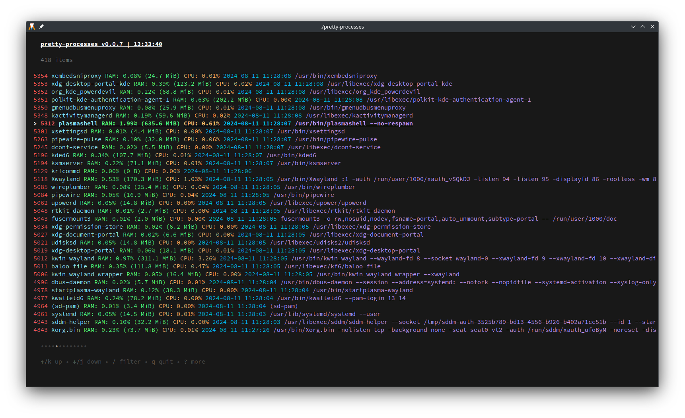

# pretty-processes

### TUI application for listing and managing linux processes. It uses [Bubble Tea](https://github.com/charmbracelet/bubbletea) for the interface and [gopsutil](https://github.com/shirou/gopsutil) to get processes.

### Available :
  - Listing of processes
  - Displaying of informations (PID, Name, MEM %/Used, CPU %, Creation date, Command)
  - Filtering by pid or name
  - Updates at interval
  - Help menu

### Not available yet :
  - Killing a selected process
  - Sorting
  - Filtering by a choosen parameter
  - ... Any other idea

Note : Right now, the list isn't updated when there is a filter, it will be fixed later.

